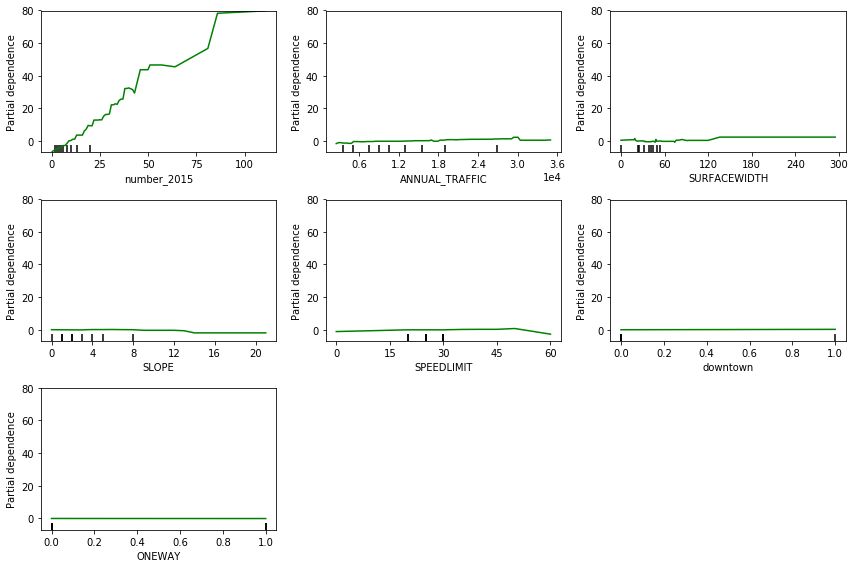
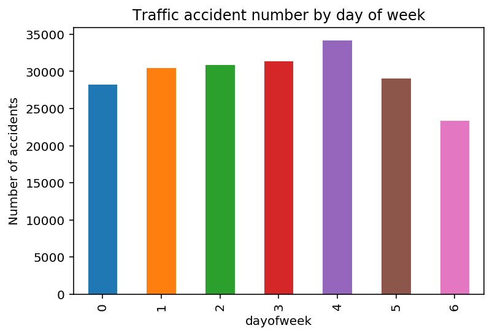

# **TRAFFIC ACCIDENTS**

Car accidents cause a lot of injuries and death. Data science can be used for good, and finding out why and how car accidents happen helps authorities and people prevent different fatalities.

# **Project Goal:**

Predict the number of accidents for the road segments of Seattle City using road features such as geolocation, surface width, segment length, the slope of the segment. Finding out possible relationships of the road segments with accidents rates will have a number of applications:

Finding out possible causes of accidents will have a number of applications:

# **APPLICATIONS:**

Commuters make a daily safe route planning, emergency vehicles will be evenly allocated, cities will better design risky roads.

# **DATA**

In this project, three data sets are used: traffic volume data of the road segments(2016), road network data, traffic accident data(2016). All the data sets are from the open data of Seattle City.

# **Project steps:**

**1.** Open traffic data from Seattle city is obtained and merged with the traffic volume data of the city by corresponding each accident location to the nearest road segment in the traffic volume data.

**2.** The traffic volume data is merged with the road network data to get the road features for each road segment.

**3.** Run a linear regression, random forest regressor and gradient boosting regressor models on 2016 traffic accident counts per road segment using the previous year’s traffic accident count, annual daily traffic volume, speed limit of the road, whether the road is in downtown or not. 

# **Results:**

Compare the results to the baseline model by root mean square error. The baseline model is predicting the number of accidents using the number from the previous year. The root mean square error (RMSE) is slightly lower for the linear model than the other models:

# Maps for accidents, roads and segments.

Users/gulomjon/galvanize/capstone

# **RMSE:**

Baseline = 4.31,
Linear Regression = 4.13,
Random Forest = 4.21,
Gradient Boosting = 4.20

The results tell that For every annual daily traffic volume of about 27,000 the number of accidents increase by 1, and the number of accidents is strongly correlated with the number for the previous year (correlation index = 0.88)
Although linear linear regression improved the model, the data is mostly noise.

Below is the partial dependence plot:

Since there are many factors that may cause individual traffic accidents, using only road features may not give the best results in predicting the number accidents of the road segments.

# **Future work:**
Adding more features such as weather, population may improve the prediction of traffic accidents. And it is important to note that individual traffic accidents have different features themselves, for example, time of accident, day of accident, light condition, and others. The plot below show the number of accidents by day of week.

